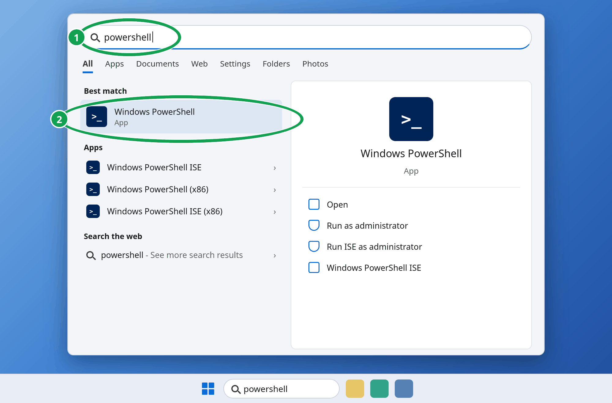
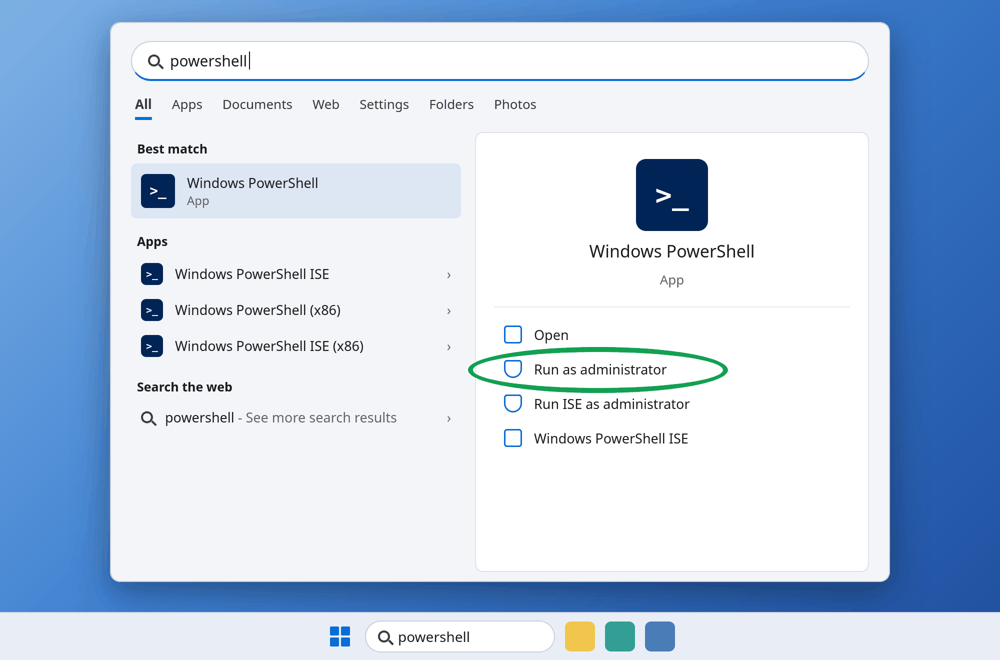
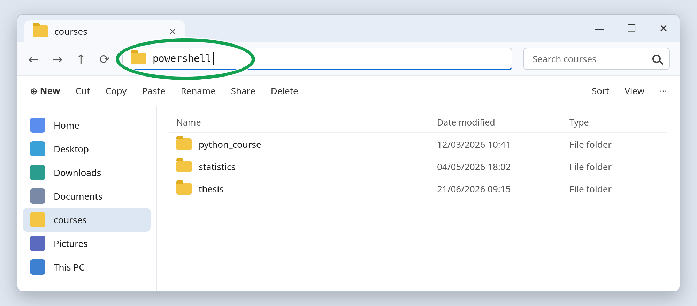
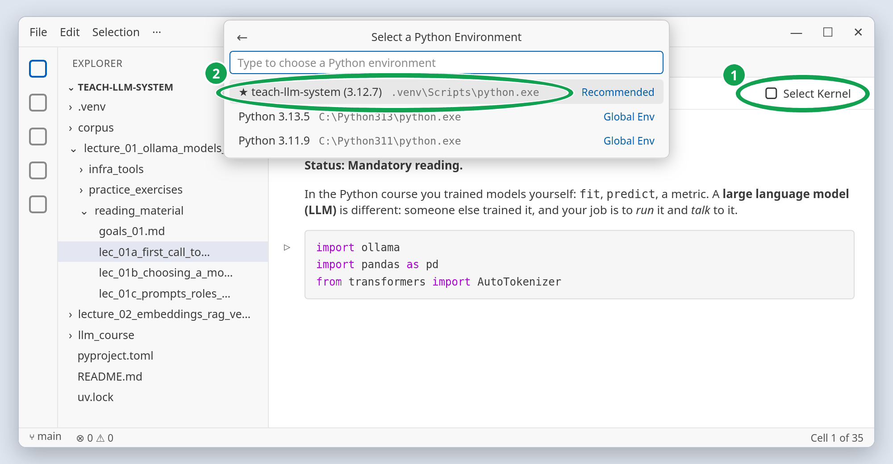

# 01a git and uv: set up the course project

## Quick start

**Windows:** use the Applications Menu, type "Powershell" and select "Run as
Administrator".





## Install `Git`

```powershell
winget install --id Git.Git -e
```

### Install `uv`

```powershell
powershell -ExecutionPolicy ByPass -c "irm https://astral.sh/uv/install.ps1 | iex"
```

**macOS** (click **Install** in the window that `xcode-select` opens):

```bash
xcode-select --install
curl -LsSf https://astral.sh/uv/install.sh | sh
```

**Linux (Debian/Ubuntu):**

```bash
sudo apt install git
curl -LsSf https://astral.sh/uv/install.sh | sh
```

Close the terminal and open a new one. Then verify the installations finished, on every
system:

```bash
git --version
uv --version
```

### Clone the lecture files in your prefered directory

Go to the folder that you want the course to be located and open a terminal in that
directory. In Windows you could use the file explorer and in the address bar, you could
type: `powershell`.



Then, in the terminal:

```bash
git clone https://github.com/argythana/teach-llm-system.git
cd teach-llm-system
uv sync                 # a few minutes; leave it running
```

### Open the notebooks in VS Code

When `uv sync` has finished, open VS Code (section 6 if it is not installed yet):

1. **File → Open Folder...** and choose the `teach-llm-system` folder.
1. In the Explorer panel on the left, open `lecture_01_ollama_models_prompts_langchain`,
   then `reading_material`, then `lec_01a_first_call_tokens_context.ipynb`.
1. Click **Select Kernel** (top right of the notebook) → **Python Environments...** →
   the `teach-llm-system` entry, marked **Recommended**.



VS Code asks the first time you run a notebook and remembers the choice.

The sections below explain every step; they are part of the study material. If a step
fails, look up the message in [troubleshooting](../../troubleshooting.md).

## Overview

Two programs come first. **git** downloads the course and later fetches the instructor's
updates. **`uv`** builds the Python environment the course needs. This guide goes in
order: install git, download the course, install `uv`, see how `uv` creates virtual
environments, let `uv sync` build the course environment, then open the notebooks in VS
Code.

## Where to type the commands

Every command in these guides goes in a **terminal**, never in a notebook cell. Only the
blocks marked `python` belong in a notebook.

- **Windows:** PowerShell (Start menu, type "PowerShell").
- **macOS:** the Terminal app (Applications → Utilities → Terminal).
- **Linux:** your terminal application.
- **VS Code:** **Terminal → New Terminal** opens the same kind of terminal inside the
  editor.

Some commands work from any folder (`git clone`, `uv --version`, `ollama pull`). The
commands that use the course environment (`uv sync`, `uv run ...`) only work from inside
the `teach-llm-system` folder; move there with `cd teach-llm-system`. Each step below
says which.

## 1. Install git

[`git`](https://git-scm.com/) is the version-control tool the course repository lives
in. With it you download the course once and later fetch the instructor's updates with
one command, instead of downloading a new ZIP each week.

- **Windows:** `winget install --id Git.Git -e`, or the installer from
  [git-scm.com](https://git-scm.com/downloads/win) (the default options are fine).
- **macOS:** `xcode-select --install`, or `brew install git` if you use Homebrew.
- **Linux (Debian/Ubuntu):** `sudo apt install git`.

Close and reopen the terminal, then check:

```bash
git --version
```

This course needs only three commands: `git clone`, `git pull`, `git restore`. To learn
more about git:

- [Pro Git](https://git-scm.com/book/en/v2), the free official book, also
  [in Greek](https://git-scm.com/book/gr/v2).
- The official [git tutorial](https://git-scm.com/docs/gittutorial), and GitHub's list
  of
  [git and GitHub learning resources](https://docs.github.com/en/get-started/start-your-journey/git-and-github-learning-resources).
- [Git & GitHub](https://github.com/argythana/dev_boilerplate_course/blob/main/lectures/lecture_1_git_GitHub/git_GitHub.md),
  a lecture by the instructor of this course.

## 2. Get the course files

In a terminal, in the folder where you keep your course work:

```bash
git clone https://github.com/argythana/teach-llm-system.git
cd teach-llm-system
```

`git clone` creates the `teach-llm-system` folder; `cd` moves the terminal into it.
Every later command in this guide runs from there. Avoid a folder that OneDrive, iCloud
Drive or Dropbox synchronises: `.venv/` (section 5) holds about 2 GB in tens of
thousands of files, and syncing them slows everything down.

When the instructor pushes new material, run `git pull` inside this folder, then
`uv sync` (section 5) in case the packages changed.

Running a notebook changes its file (the outputs are saved in it), and `git pull`
refuses to overwrite a course file you changed. Keep your own experiments in a copy
(**File → Save As...** with a new name); git leaves new files alone. To throw away your
changes to the course files before pulling, run `git restore .` (it does not touch your
copies or your `.env`).

Without git: download the repository as a ZIP from GitHub (green **Code** button) and
unzip it. You will have to download it again for every update.

## 3. Install uv

In the Python course you created a virtual environment with `python -m venv` and
installed packages with `pip install -r requirements.txt`. This course uses **`uv`**,
one tool that does both jobs, can also install Python itself, and records the exact
versions it installed in `uv.lock`, so every student and the instructor run the same
code.

To explore `uv`: [source on GitHub](https://github.com/astral-sh/uv),
[documentation](https://docs.astral.sh/uv/).

In a terminal, from any folder:

**Windows (PowerShell):**

```powershell
powershell -ExecutionPolicy ByPass -c "irm https://astral.sh/uv/install.ps1 | iex"
```

**macOS / Linux:**

```bash
curl -LsSf https://astral.sh/uv/install.sh | sh
```

Close and reopen the terminal, then check:

```bash
uv --version
```

If the command is not found on Windows, the installer printed the folder it used
(usually `C:\Users\<you>\.local\bin`); add it to your PATH or reopen the terminal.

Unlike a Python package, `uv` is a program installed on your computer once, like `git`
or Ollama: it stays installed after a restart and works in every terminal.

## 4. How uv creates a virtual environment

`uv` has its own command for what `python -m venv` did in the Python course:

```bash
uv venv --python 3.13
```

Two differences matter:

- **You choose the Python version.** `python -m venv` can only copy the Python you ran
  it with. `uv venv --python 3.13` uses 3.13, and if it is not on your computer, `uv`
  downloads it first. `uv python list` shows the versions available.
- **The folder is always `.venv/`** in the current directory, unless you give another
  name (`uv venv my_env`).

You can try it in an empty scratch folder and delete the folder afterwards. **You do not
need to run it for this course**: the next step does it for you.

## 5. Create the course environment with `uv sync`

A notebook that runs on one laptop can fail on another: a package is missing, or it has
another version that behaves differently. The virtual environment of the Python course
solved half of this. The other half stayed open: a `requirements.txt` usually lists only
the packages you asked for, while the packages *they* need, their **dependencies**, and
often the exact versions are whatever pip finds that day. `uv` closes the gap with a
**lock file**,
[`uv.lock`](https://docs.astral.sh/uv/concepts/projects/layout/#the-lockfile): the exact
version of every package, dependencies included.

The instructor has already decided the environment and pushed the decision to git, in
three files in the repository:

| File              | What it pins                                              |
| ----------------- | --------------------------------------------------------- |
| `.python-version` | the Python version (3.12)                                 |
| `pyproject.toml`  | the packages the course needs, like `requirements.txt`    |
| `uv.lock`         | the exact version of every package, dependencies included |

From inside the `teach-llm-system` folder, run:

```bash
uv sync
```

`uv sync` reads these three files and does everything in one command: it downloads
Python 3.12 if you do not have it, creates `.venv/` with that version (the `uv venv`
step of section 4), and installs exactly the versions in `uv.lock` (about 2 GB, a few
minutes the first time). Running it again only fixes what differs from the lock, so it
is safe to rerun, for example after a `git pull`.

If it fails with
`` error: No `pyproject.toml` found in current directory or any parent directory ``, the
terminal is in the wrong folder: `cd` into `teach-llm-system` first.

The whole workflow, next to what you did in the Python course:

| venv + pip (Python course)        | uv (this course)                                        |
| --------------------------------- | ------------------------------------------------------- |
| `python -m venv course_venv`      | `uv venv --python 3.12` (done by `uv sync`)             |
| `pip install -r requirements.txt` | `uv sync` (creates `.venv/` and installs)               |
| `pip install some-package`        | `uv add some-package`                                   |
| activate, then `jupyter lab`      | VS Code with the course kernel (section 6)              |
| `pip install` a command-line tool | `uvx llmfit` or `uv tool install llmfit` (last section) |

## 6. Open the notebooks with the right interpreter

The notebooks are opened in [VS Code](https://code.visualstudio.com/), an editor that
runs
[Jupyter notebooks](https://code.visualstudio.com/docs/datascience/jupyter-notebooks) in
the same window as the course files and a terminal.

**Install once:**

- **VS Code** from [code.visualstudio.com](https://code.visualstudio.com/). On Windows
  this also works:

  ```powershell
  winget install --id Microsoft.VisualStudioCode -e
  ```

- **Two extensions**, both by Microsoft:
  [Python](https://marketplace.visualstudio.com/items?itemName=ms-python.python) and
  [Jupyter](https://marketplace.visualstudio.com/items?itemName=ms-toolsai.jupyter). In
  VS Code, open the Extensions panel (**View → Extensions**), search each name, and
  click **Install**.

**Open the course folder.** **File → Open Folder...** and choose `teach-llm-system`
itself, not a lecture folder inside it: VS Code looks for `.venv/` in the folder you
open. Then open a notebook from the Explorer panel on the left.

**Select the interpreter, the first time you run a notebook.** A notebook runs on a
**kernel**: the Python process that executes its cells. `.venv/` holds the Python
interpreter that has the course packages, so the kernel must be that one:

1. Click **Select Kernel** at the top right of the notebook (running a cell opens the
   same list).
1. Choose **Python Environments...**.
1. Choose the entry named after the course folder, `teach-llm-system (3.12.x)`, which VS
   Code marks **Recommended** (the picture in the quick start shows this list).

`uv` gives `.venv/` the name of the folder it was created in, and VS Code lists the
environment under that name; older versions of VS Code show `.venv` instead. In both
cases the path next to the name is the reliable sign: `.venv\Scripts\python.exe` on
Windows, `.venv/bin/python` on macOS and Linux.

VS Code remembers the choice for that notebook, and the button then shows
`teach-llm-system (3.12.x)` instead of **Select Kernel**. Without this step the notebook
runs on whatever Python VS Code found last, and the first `import` fails. If the entry
is not in the list, `uv sync` has not finished or you opened a different folder.

To check, run this in a notebook cell; the path must contain `teach-llm-system/.venv`:

```python
import sys

print(sys.executable)
```

The kernel choice applies to notebooks only. A command typed in a terminal uses `.venv/`
when it starts with `uv run`: `uv run <command>` runs the command inside `.venv/`. Use
it for every tool of the course environment (`uv run mlflow server ...` in lecture 2).

## Optional packages

Two career-track notebooks need extra packages that most students will not install. From
the `teach-llm-system` folder:

```bash
uv sync --group pgvector          # lec_02e, needs Docker too
uv sync --group transformers-run  # lec_01e, downloads PyTorch (~200 MB)
```

`uv sync` makes `.venv/` match exactly what you ask for, so a later plain `uv sync` (for
example after a `git pull`) removes these extras again. Repeat the `--group` option
every time you sync while you still need them.

## Never use pip in this project

`pip install` still works, and that is the trap: it bypasses `uv.lock`, so your
environment silently differs from everyone else's. In the comment below, **PATH** is the
list of folders where the terminal looks for programs:

```bash
# WRONG: installs into whatever Python is first on PATH, invisible to uv.lock
pip install ollama

# RIGHT: adds the package to pyproject.toml and uv.lock, then installs it
uv add ollama
```

If a notebook fails with `ModuleNotFoundError`:

- **A course package:** run `uv sync` (the instructor may have added a package in the
  last `git pull`), or the `uv sync --group ...` line above for an optional notebook.
- **A package for your own experiment:** `uv add <package>`, not pip. It also writes the
  package into `pyproject.toml` and `uv.lock`, which are course files, so the next
  `git pull` may refuse to run until you undo that with `git restore .`.

## Command-line tools: `uvx` or `uv tool install`

Some programs are **command-line tools** you run in a terminal, not packages you
`import` in a notebook. `llmfit` (guide `01b_llmfit`) is one. `uv` can run such a tool
in three ways, and the difference is where the tool lives:

- **`uv run <tool>`**: the tool is a package of the course environment, installed in
  `.venv/` by `uv sync`. `mlflow` is used this way, because the notebooks also import
  it.
- **`uvx <tool>`**: runs the tool without installing it.
- **`uv tool install <tool>`**: installs the tool once, for your user, in its own
  environment outside any project.

The last two compared, with `llmfit`:

|                        | `uvx llmfit`                                                | `uv tool install llmfit`               |
| ---------------------- | ----------------------------------------------------------- | -------------------------------------- |
| What happens           | a disposable environment in uv's **cache** runs the tool    | a permanent environment for the tool   |
| The first time         | downloads the latest version, then runs it                  | downloads it; nothing runs yet         |
| Every later time       | reuses the cached copy, **without checking for updates**    | the same version, until you upgrade it |
| What you type          | `uvx llmfit recommend`, every time                          | `llmfit recommend`, from any folder    |
| Get the newest version | `uvx llmfit@latest recommend`                               | `uv tool upgrade llmfit`               |
| How it disappears      | `uv cache clean` deletes it; the next `uvx` downloads again | `uv tool uninstall llmfit`             |
| Good for               | trying a tool, or a tool you run once in a while            | a tool you use often                   |

Good to know:

- **Neither touches the course.** Both work from any folder and change nothing in
  `.venv/`, `pyproject.toml` or `uv.lock`. For the same reason, a notebook cannot
  `import` a tool installed this way.
- **The course installs llmfit with `uv tool install`.** Lecture 1b runs the installed
  `llmfit` from Python, so `uvx llmfit` is not enough there.
- **`llmfit: command not found` after `uv tool install`:** the tool went into
  `~/.local/bin` (Windows: `C:\Users\<you>\.local\bin`), the folder the uv installer
  also uses, and that folder must be on your PATH. Run `uv tool update-shell` and reopen
  the terminal.
- `uv tool list` shows the tools you installed.

Details: [Tools in the uv documentation](https://docs.astral.sh/uv/concepts/tools/).
