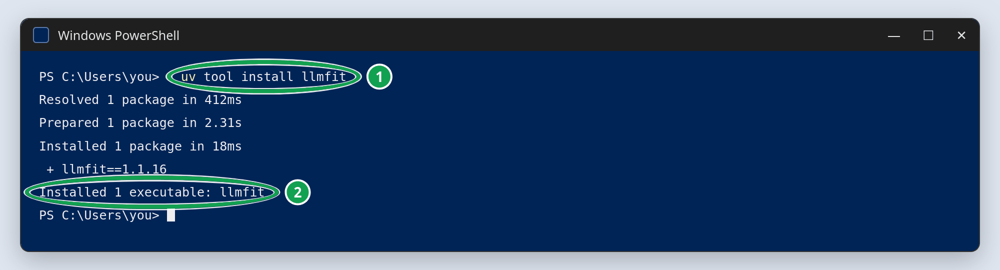
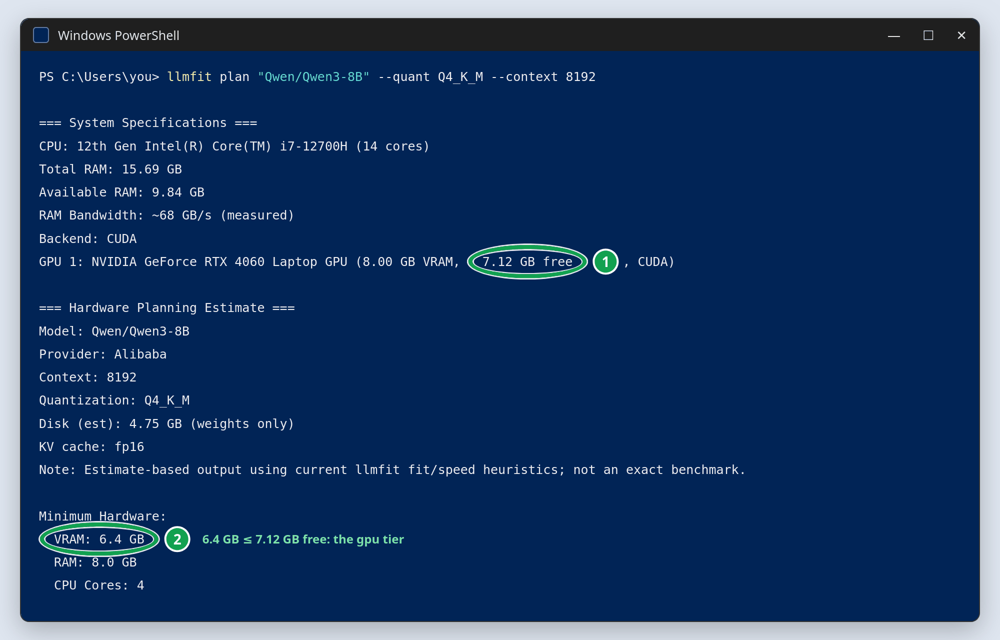

# 01b llmfit: which models fit your machine?

## Quick start

Open a new terminal, in any folder; leave `uv sync` from guide `01a_git_uv` running in
its own window.

**Windows:** use the Applications Menu, type "Powershell" and select "Windows
PowerShell". This time you do not need "Run as administrator".


**macOS / Linux:** open the Terminal.

Install llmfit, the same command on every system:

```powershell
uv tool install llmfit
```



Then ask it about the two course models:

```powershell
llmfit plan "Qwen/Qwen3-1.7B" --quant Q4_K_M --context 8192
llmfit plan "Qwen/Qwen3-8B" --quant Q4_K_M --context 8192
```



Your tier: `gpu` if the `Minimum Hardware: VRAM` of Qwen3-8B (2 in the picture, 6.4 GB)
is at most the free VRAM of your GPU (1); `cpu` otherwise, and also when no `GPU` line
appears.

If the terminal does not find `llmfit` (PowerShell:
`The term 'llmfit' is not recognized`), run `uv tool update-shell`, open a new terminal,
and repeat the `llmfit` lines.

The sections below explain every step; they are part of the study material. If a step
fails, look up the message in [troubleshooting](../../troubleshooting.md).

## Overview

A model that fits in memory runs; one that does not either fails or crawls. `llmfit`
reads your CPU, RAM, GPU and VRAM and scores hundreds of open models on **fit**,
**speed**, **quality** and **context**. Source:
[GitHub](https://github.com/AlexsJones/llmfit); website and documentation:
[llmfit.axjns.dev](https://llmfit.axjns.dev/).

`llmfit` compares your hardware with its own catalogue of models and downloads no model.
Its answer decides your **tier** (section "Choosing your tier"), and the tier decides
whether guide `01c_ollama` asks you to download the 5 GB GPU-tier model.

It is a **command-line tool**. You run it in a terminal, from any folder, not in a
notebook, and it is not part of the course environment: `uv sync` does not install it.

`llmfit` is also published on PyPI as a Python package. This means that we could also
install it as a Python package if our use case were a project whose own code runs
llmfit: `uv add llmfit` would record it in `pyproject.toml` and `uv.lock`, so everyone
runs the same version with `uv run llmfit`. The package only carries the program; it has
no functions to `import`. This course only needs llmfit to choose a tier, and lecture 1b
calls it through `uvx`, so it stays out of the course environment.

## Install it once, with `uv tool install`

```bash
uv tool install llmfit
llmfit system
```

Now `llmfit` is a command of its own, in every terminal and every folder, until you run
`uv tool uninstall llmfit`. Update it with `uv tool upgrade llmfit`. `uv` keeps the
program in a folder of your user, `C:\Users\<you>\.local\bin` on Windows and
`~/.local/bin` on macOS and Linux, and the terminal finds it only if that folder is on
its `PATH`, the list of folders it searches for commands. If the terminal says
`llmfit: command not found` (PowerShell: `The term 'llmfit' is not recognized`), run
`uv tool update-shell`, which adds the folder, and reopen the terminal.

Lecture 1b calls `uvx llmfit` from Python, which also uses your installed copy.

## The basic CLI commands

```bash
llmfit system                  # what llmfit detected: CPU, RAM, GPU, VRAM
llmfit plan "Qwen/Qwen3-8B" --quant Q4_K_M --context 8192   # one model: memory and speed
llmfit fit -n 10               # the 10 best-scoring models of every kind, as a table
llmfit recommend               # the top 5, as JSON
```

`llmfit recommend` prints **JSON**, a format for programs rather than people; lecture 1b
reads it from Python and turns it into a table. To browse by eye, run `llmfit` without
arguments: it opens an interactive browser in the terminal; press `q` to leave.

llmfit names models by their Hugging Face name (`Qwen/Qwen3-8B`); `llmfit search qwen3`
finds the exact name.

## Which kind of model this course needs

The course uses two kinds of models, and llmfit labels each with a **use case**:

| Job in the course                                       | Course model             | llmfit use case     |
| ------------------------------------------------------- | ------------------------ | ------------------- |
| answer questions and follow instructions (all lectures) | `qwen3:1.7b`, `qwen3:8b` | `general` or `chat` |
| turn text into vectors for search (lecture 2)           | `nomic-embed-text`       | `embedding`         |

The first kind is an **instruction-tuned** model (`Instruct`, `it` or `chat` in its
name): a model trained further to follow instructions and hold a conversation. A
**base** model, without that training, only continues the text you give it. llmfit
labels Qwen3 `general`, because it both chats and reasons, and most `-Instruct` models
`chat`. Its other use cases (coding, multimodal, reasoning, text-to-speech) are other
jobs. The embedding model is small (274 MB) and fits every laptop, so the tier decision
is only about the chat model.

## Model providers

llmfit rates models; it does not run them. The program or service that loads a model and
answers requests is a **model provider**:

- **Local providers** run on your computer: Ollama (this course, guide `01c_ollama`),
  [LM Studio](https://lmstudio.ai), or the server of
  [llama.cpp](https://github.com/ggml-org/llama.cpp).
- **Hosted providers** run models in a data centre and bill per token, for example
  [Hugging Face's inference providers](https://huggingface.co/docs/inference-providers/index)
  (`lec_01f`).

A provider runs a model with an **engine**, llmfit's `Runtime` column:

- Ollama and LMStudio use the llama.cpp engine on GGUF files.
- [vLLM](https://docs.vllm.ai) is an engine for GPU servers. llmfit's `Provider` column
  means something else: who published the model (Alibaba for Qwen).

## The 5 best chat models for your machine and the course's usecases

`llmfit recommend` has helpful filters:

```bash
llmfit recommend --use-case chat --runtime llamacpp -n 5 --license apache-2.0,mit --min-fit perfect --csv > llmfit_chat_perfect.csv
```

In Windows PowerShell, save the file with `Set-Content` instead of `>`:

```powershell
llmfit recommend --use-case chat --runtime llamacpp -n 5 --license apache-2.0,mit --min-fit perfect --csv | Set-Content -Encoding utf8 llmfit_chat_perfect.csv
```

Windows PowerShell's `>` writes text in UTF-16, an encoding `pd.read_csv` does not read
by default (`UnicodeDecodeError: 'utf-8' codec can't decode byte 0xff`);
`Set-Content -Encoding utf8` writes the UTF-8 that pandas expects.

- `--use-case chat`: only instruction-following chat models. Run it again with
  `--use-case general` for models labelled like Qwen3. It takes one use case per run:
  `--use-case chat,general` gives no error but switches the filter off, and the list
  then also holds coding, embedding and multimodal models.
- `--runtime llamacpp`: estimates for the engine of local providers such as Ollama.
- `-n 5`: five models.
- `--license apache-2.0,mit`: only models under the two most permissive licenses, which
  allow any use, including commercial (the license row of lecture 1b's requirements
  table).
- `--min-fit perfect`: only models that fit with room to spare. `--min-fit good` also
  keeps `Good`; the default keeps `Marginal` too.
- `--csv > llmfit_chat_perfect.csv`: a table instead of JSON, saved as
  `llmfit_chat_perfect.csv` in the current folder. Open it in VS Code or a spreadsheet,
  or with `pd.read_csv`.

## Reading the output

- **Fit**: does the model's memory need (weights plus context) fit your RAM or VRAM?
- **Speed**: an estimate of tokens per second on your hardware.
- **Quality**: a rough quality score for the model size.
- **Context**: how long a prompt the model can hold.

The verdict here is about *hardware*. Lecture 1b adds the other, more important, part:
the business requirements (task, languages, license, context, privacy) that decide which
of the models that fit you should actually use.

## Choosing your tier

The course uses two sizes of one model family: `qwen3:1.7b` for the `cpu` tier and
`qwen3:8b` for the `gpu` tier. Ask llmfit to plan both, the way Ollama ships them:

```bash
llmfit plan "Qwen/Qwen3-1.7B" --quant Q4_K_M --context 8192   # the cpu tier
llmfit plan "Qwen/Qwen3-8B" --quant Q4_K_M --context 8192     # the gpu tier
llmfit system                                                 # your GPU and its free VRAM
```

- `--quant Q4_K_M`: the quantization of Ollama's `qwen3` builds (lecture 1b explains
  quantization).
- `--context 8192`: the prompt length the course needs.

`plan` needs no model provider. It first prints what `llmfit system` prints, so the
`GPU` line with its free VRAM is at the top of its output (the picture in the Quick
start). The free VRAM is measured right now: if a provider already holds a model in
memory (with Ollama, `ollama ps` lists it), unload it first. Then compare:

- **`Minimum Hardware: VRAM` of Qwen3-8B (6.4 GB) is at most the free VRAM that
  `llmfit system` shows:** choose the `gpu` tier. In one example run, a laptop GPU with
  8 GB of VRAM held `qwen3:8b` entirely and wrote about 31 tokens/s.
- **Anything else, or no GPU found:** choose the `cpu` tier, the default. Under
  `Feasible Run Paths`, the `CPU-only` line of Qwen3-1.7B estimates the speed you will
  get; the course needs 10 tokens/s or more.

Why not `llmfit info`? It sizes the model at the quantization llmfit would pick for your
hardware, often a larger one than a provider ships. For `Qwen/Qwen3-8B` on an 8 GB GPU
it says `Marginal`, although Ollama's smaller build fits.

Every notebook starts with a configuration cell where you set the tier:

```python
TIER = "cpu"  # 8-16 GB RAM, no GPU (default)
# TIER = "gpu"  # >= 8 GB VRAM: bigger, better answers (pull qwen3:8b first)
```

## The course uses Qwen3: the candidates compared

llmfit answers "can I run it?". The course's requirements (lecture 1b) answer "should
I?": Greek questions must work, the license must allow any use, and the model must be
small enough for an 8 GB laptop. The candidates, checked in September 2026:

| Model (Ollama tag)      | License                     | Greek                            | Ollama download         | llmfit CPU-only tok/s | Verdict                                         |
| ----------------------- | --------------------------- | -------------------------------- | ----------------------- | --------------------- | ----------------------------------------------- |
| `qwen3:1.7b` (cpu tier) | Apache 2.0                  | yes (100+ languages)             | 1.4 GB                  | 11.9                  | meets every requirement                         |
| `qwen3:8b` (gpu tier)   | Apache 2.0                  | yes (100+ languages)             | 5.2 GB                  | 2.9 (GPU: 30.9)       | meets every requirement on a GPU                |
| `qwen3.5:2b`            | Apache 2.0                  | yes (201 languages)              | 2.7 GB                  | 10.6                  | the credible successor; bigger, a little slower |
| `llama3.2:1b`, `:3b`    | Llama 3.2 Community License | not officially supported         | 1.3 / 2.0 GB            | 19.5 / 7.5            | fails license and language                      |
| `gemma3:1b`             | Gemma Terms of Use          | English only                     | 815 MB                  | 24.2                  | fails license and language                      |
| `gemma4:e2b`            | Apache 2.0                  | not among its 35+ main languages | 7.2 GB (vision, audio)  | 4.7                   | too large for an 8 GB laptop, and slow          |
| `phi4-mini`             | MIT                         | no (23 languages)                | 2.5 GB                  | 6.3                   | fails language and speed                        |
| `granite4:3b`           | Apache 2.0                  | no (12 languages)                | 2.1 GB                  | 7.1                   | fails language and speed                        |
| SmolLM3-3B              | Apache 2.0                  | no (8 languages)                 | not in Ollama's library | 7.9                   | fails language and speed                        |

`llmfit CPU-only tok/s` is the `CPU-only` estimate of `llmfit plan` with the same
quantization (`Q4_K_M`) and context (8192) for every model, on one example laptop.
llmfit is cautious: in the same example run, `qwen3:1.7b` measured about 35 tokens/s on
the CPU. Your numbers differ, but the order carries over. On a CPU, speed depends mostly
on how many bytes the model reads per token, so the only candidates faster than
`qwen3:1.7b` are smaller ones, and each of them fails the language or the license
requirement. `qwen3.5:2b` is the one to test for the next edition of the course.

### Verify the table yourself

Estimated speeds, from llmfit. In Windows PowerShell:

```powershell
$models = "Qwen/Qwen3-1.7B", "Qwen/Qwen3-8B", "Qwen/Qwen3.5-2B",
  "meta-llama/Llama-3.2-1B-Instruct", "meta-llama/Llama-3.2-3B-Instruct",
  "google/gemma-3-1b-it", "google/gemma-4-E2B-it", "microsoft/Phi-4-mini-instruct",
  "ibm-granite/granite-4.0-micro", "HuggingFaceTB/SmolLM3-3B"
foreach ($m in $models) {
  uvx llmfit plan $m --quant Q4_K_M --context 8192 | Select-String "^Model:|^  (GPU|CPU offload|CPU-only):|est speed"
}
```

In the macOS or Linux Terminal:

```bash
for m in Qwen/Qwen3-1.7B Qwen/Qwen3-8B Qwen/Qwen3.5-2B \
         meta-llama/Llama-3.2-1B-Instruct meta-llama/Llama-3.2-3B-Instruct \
         google/gemma-3-1b-it google/gemma-4-E2B-it microsoft/Phi-4-mini-instruct \
         ibm-granite/granite-4.0-micro HuggingFaceTB/SmolLM3-3B; do
  uvx llmfit plan "$m" --quant Q4_K_M --context 8192 | grep -E "^Model:|^  (GPU|CPU offload|CPU-only):|est speed"
done
```

Each model prints one speed per way to run it: `GPU` (the whole model in GPU memory),
`CPU offload` (split between GPU and system RAM) and `CPU-only` (no GPU). The table uses
the `CPU-only` line.

Licenses, languages and download sizes are on each model's page:

- in Ollama's library, for example [model qwen3](https://ollama.com/library/qwen3),
- and the model card on Hugging Face, for example
  [huggingface.co/Qwen/Qwen3-1.7B](https://huggingface.co/Qwen/Qwen3-1.7B).
