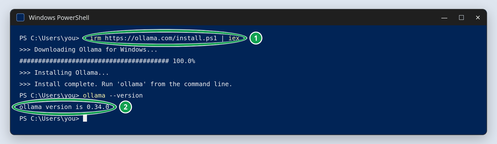
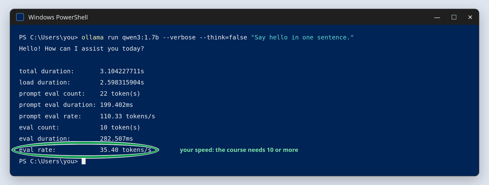

# 01c Ollama: install it and pull the course models

## Quick start

Install Ollama.

**Windows:** open PowerShell as in guide `01b_llmfit` (Applications Menu, type
"Powershell", select "Windows PowerShell"; no administrator needed) and run:

```powershell
irm https://ollama.com/install.ps1 | iex
ollama --version
```



The other way works too: download the installer from <https://ollama.com/download> and
run it. It installs the same Ollama; then continue in PowerShell with
`ollama --version`.

**macOS:** download the app from <https://ollama.com/download> and open it once.

**Linux:** `curl -fsSL https://ollama.com/install.sh | sh`

Open a new terminal (on Windows, PowerShell again). Then, on every system, from any
folder:

```powershell
ollama --version
ollama pull qwen3:1.7b          # a few minutes; leave it running
ollama pull qwen3:0.6b
ollama pull nomic-embed-text
ollama list
ollama run qwen3:1.7b --verbose --think=false "Say hello in one sentence."
```



Only on the `gpu` tier (guide `01b_llmfit`):

```powershell
ollama pull qwen3:8b
ollama run qwen3:8b --verbose --think=false "Say hello in one sentence."
ollama ps                       # should show 100% GPU
```

The sections below explain every step; they are part of the study material. If a step
fails, look up the message in [troubleshooting](../../troubleshooting.md).

## Overview

**Ollama** runs open language models on your own computer. Nothing you type leaves your
laptop.

A model is a large file of numbers, up to several gigabytes. To answer, a program must
load it into memory, which takes seconds, keep it there, and run the computation on the
CPU or the GPU. Loading it inside every notebook would repeat that wait and hold one
copy per notebook. Ollama solves this with a **server**: a program that keeps running in
the background, holds the model in memory, and waits for requests at an address,
`http://localhost:11434` (section "What `http://localhost:11434` means"). Your code is
the **client**: it sends a request and gets a response back. `mlflow server` in the
Python course worked the same way.

Ollama is a **system-native application**: it installs like a browser or an editor, not
like a Python package, so `uv sync` does not install it.\
Source: [GitHub](https://github.com/ollama/ollama); documentation:
[docs.ollama.com](https://docs.ollama.com/); the catalogue of models:
[ollama.com/library](https://ollama.com/library).

## 1. Install

- **Windows:** in PowerShell, `irm https://ollama.com/install.ps1 | iex`, the command
  that Ollama's [Windows download page](https://ollama.com/download/windows) gives.
  `irm` (Invoke-RestMethod) downloads Ollama's install script, and `iex`
  (Invoke-Expression) runs it; the same pattern installed `uv` in guide `01a_git_uv`.
  The script downloads the official installer, checks its signature, and installs Ollama
  for your user only, so it needs no administrator rights. It also makes `ollama`
  available in that same window, which is why `ollama --version` works right after it.
  Ollama then starts automatically and shows an icon in the system tray. Downloading the
  installer from <https://ollama.com/download> and running it works too, and gives the
  same result: use it if the command fails, for example on a network that blocks
  scripts.
- **macOS:** download the app from <https://ollama.com/download>, open it once, and it
  shows an icon in the menu bar. (`brew install ollama` also works, but installs only
  the command-line server; see section 2.)
- **Linux:** in a terminal, `curl -fsSL https://ollama.com/install.sh | sh`

Check in a terminal, from any folder:

```bash
ollama --version
```

## 2. Ollama keeps running in the background

A Python package exists only while a notebook `import`s it. The Ollama application is
different: it is a **background server** that keeps running when you close the terminal,
starts again by itself after a restart, and waits for requests. You never start it from
a notebook, and you do not need to start it before each session.

| System                       | Starts again after a restart?                    | Where you see it          | How to stop it                  |
| ---------------------------- | ------------------------------------------------ | ------------------------- | ------------------------------- |
| Windows                      | yes, when you sign in                            | llama icon in the tray    | tray icon → **Quit Ollama**     |
| macOS, the app               | yes, when you log in                             | llama icon, menu bar      | menu bar icon → **Quit Ollama** |
| macOS, `brew install ollama` | only after `brew services start ollama` (once)   | `brew services list`      | `brew services stop ollama`     |
| Linux                        | yes, at boot: the installer registered a service | `systemctl status ollama` | `sudo systemctl stop ollama`    |

Running in the background costs almost nothing. A model uses RAM only while it is
loaded, and Ollama unloads it after 5 minutes without requests (`ollama ps` shows what
is loaded). To stop the automatic start, see the
[Ollama FAQ](https://docs.ollama.com/faq).

To check that it is running, open <http://localhost:11434> in a browser: it answers
`Ollama is running`.

## 3. Pull the course models

In a terminal, from any folder. Three models are used in the lectures; downloads are
one-time (about 2.2 GB in total):

```bash
ollama pull qwen3:1.7b          # the chat model (1.4 GB)
ollama pull qwen3:0.6b          # its smaller sibling, compared with it in lecture 1b (520 MB)
ollama pull nomic-embed-text    # the embedding model (274 MB), from lecture 2 on
```

The models are stored in Ollama's own folder, not in the course folder:
`~/.ollama/models` on macOS, `C:\Users\<you>\.ollama\models` on Windows,
`/usr/share/ollama/.ollama/models` on Linux. They stay there after a restart, for every
project, until you delete them with `ollama rm`.

Only if llmfit put you on the `gpu` tier (guide `01b_llmfit`, "Choosing your tier"),
also pull the model that `TIER = "gpu"` uses:

```bash
ollama pull qwen3:8b            # 5.2 GB
```

## 4. Check

```bash
ollama list                                                             # the pulled models
ollama run qwen3:1.7b --verbose --think=false "Say hello in one sentence."
```

The first answer takes a few seconds while the model loads into memory. Qwen3 "thinks"
aloud before answering unless told not to; `--think=false` does in the terminal what
`think=False` does in the notebooks.

`--verbose` adds timing lines after the answer (the last picture of the Quick start).
`eval rate` is your measured speed in tokens/s, the real number behind llmfit's estimate
(guide `01b_llmfit`); the course needs 10 or more. On the `gpu` tier, run the same line
with `qwen3:8b`, then `ollama ps`: `100% GPU` confirms the tier, while a split such as
`30%/70% CPU/GPU` means the model did not fit and the `cpu` tier is the better choice.

Without the quoted question, `ollama run qwen3:1.7b` opens an interactive chat in the
terminal; type `/bye` to leave it.

## What `http://localhost:11434` means

This is the address where Ollama's server waits for requests. The notebooks keep it in
the setting `OLLAMA_HOST`, and each part has a job:

| Part        | Name     | What it means                                                                                                                                                        |
| ----------- | -------- | -------------------------------------------------------------------------------------------------------------------------------------------------------------------- |
| `http://`   | **HTTP** | the [protocol](https://developer.mozilla.org/en-US/docs/Web/HTTP/Guides/Overview) browsers use for web pages: the rules for sending a request and getting a response |
| `localhost` | **host** | which computer: every computer's name for itself (`127.0.0.1` in numbers), so nothing leaves the machine                                                             |
| `11434`     | **port** | which server on that computer: each server listens on its own number; 11434 is Ollama's default                                                                      |

`mlflow server` in lecture 13 of the Python course was the same idea, at
`http://127.0.0.1:5000`. This course's MLflow listens on port 5010 (guide
`02a_mlflow_server`), so the two never collide.

An **API** (application programming interface) is the set of requests a server
understands, each at its own path after the address
([Ollama's API](https://docs.ollama.com/api/introduction)). Try two in a browser:

- <http://localhost:11434> answers `Ollama is running` (the check of section 2).
- <http://localhost:11434/api/tags> returns the pulled models as **JSON**, a text format
  for data that `lec_01c` uses for structured output.

The `ollama` command and the notebooks send these same requests for you. Ollama also
understands the request format of OpenAI's API, at `http://localhost:11434/v1`
([docs](https://docs.ollama.com/api/openai-compatibility)); the optional `lec_01f` uses
it.

## The Ollama application and the `ollama` Python package

Two different things share the name:

|                 | The Ollama application                                                                                                                 | The `ollama` Python package                                                                                             |
| --------------- | -------------------------------------------------------------------------------------------------------------------------------------- | ----------------------------------------------------------------------------------------------------------------------- |
| What it is      | a system-native program: the **server** on port `11434` plus the `ollama` command-line tool (`ollama pull`, `ollama run`, `ollama ps`) | a small Python **client library** (an SDK) that sends requests to that server                                           |
| Installed by    | the installer from ollama.com (this guide)                                                                                             | `uv sync`, from `pyproject.toml`                                                                                        |
| Runs the model? | yes, it loads the weights and generates tokens                                                                                         | no, it only talks to the application over HTTP                                                                          |
| Lives           | in the background, always (section 2)                                                                                                  | only while a notebook that imports it is running                                                                        |
| Source          | [github.com/ollama/ollama](https://github.com/ollama/ollama)                                                                           | [github.com/ollama/ollama-python](https://github.com/ollama/ollama-python), [on PyPI](https://pypi.org/project/ollama/) |

The command line and the Python package talk to the same server: a model pulled with
`ollama pull` in a terminal is immediately available to `ollama.Client(...).chat(...)`
in a notebook. If the application is not running, the package can do nothing, which is
what the `Cannot reach Ollama` message means.

The package turns each Python call into one request to the API, and the JSON reply into
a Python object whose fields you read with a dot, like `df.shape`:

| Python call                       | Request it sends                       |
| --------------------------------- | -------------------------------------- |
| `ollama.Client(host=OLLAMA_HOST)` | none; it stores the address            |
| `client.list()`                   | `/api/tags`: the models on disk        |
| `client.ps()`                     | `/api/ps`: the models loaded in memory |
| `client.chat(...)`                | `/api/chat`: a conversation            |

Where the course uses the Python package: lecture 1 talks to the server directly with it
(`lec_01a` to `lec_01c`: `client.chat`, `client.list`, `client.ps`, structured output
with `format=`), and `llm_course.checks.check_ollama` uses it in every configuration
cell. From `lec_01d` on, LangChain's `langchain-ollama` package talks to the same server
on your behalf, and in lecture 3 MLflow's judge does too; the application stays the one
thing that runs the models.

## Useful commands in a terminal

Type these in a terminal, from any folder, not in a notebook cell. The notebooks do the
same things through the Python package.

| Command                                   | What it does                                               |
| ----------------------------------------- | ---------------------------------------------------------- |
| `ollama list`                             | the models you pulled, with their size on disk             |
| `ollama ps`                               | which models are loaded now and whether on CPU or GPU      |
| `ollama stop qwen3:1.7b`                  | unload a model from memory now, instead of after 5 minutes |
| `ollama show qwen3:1.7b`                  | context length, quantization, chat template                |
| `ollama rm <model>`                       | delete a model from disk                                   |
| `ollama pull hf.co/<user>/<repo>:<quant>` | run a GGUF model straight from Hugging Face (lecture 1b)   |

## If Ollama is not running

The notebooks' first cell raises `Cannot reach Ollama at http://localhost:11434`, and in
a terminal `ollama list` prints
`Error: ollama server not responding - could not connect to ollama server`. Start it:

- **Windows / macOS app:** open Ollama from the Start menu or Applications.
- **macOS with Homebrew:** `brew services start ollama`.
- **Linux:** `sudo systemctl start ollama`.

`ollama serve` starts the server inside the current terminal instead, and it stops when
you close that terminal. You need it only where there is no background service (for
example WSL without systemd). If it prints `bind: address already in use`, Ollama is
already running and there is nothing to fix.

## If Ollama runs somewhere else

By default everything talks to `http://localhost:11434`, the Ollama on your own
computer. The setting `OLLAMA_HOST` points to another address, for example a lab machine
with a GPU.

**First test the address with the `ollama` command.** It reads `OLLAMA_HOST` from the
terminal, not from `.env`, so set it for this one test (replace the address with the
real one):

```bash
# macOS / Linux: the variable applies to this one command only
OLLAMA_HOST=http://192.168.1.20:11434 ollama list
```

```powershell
# Windows PowerShell: the variable applies to this terminal until you close it
$env:OLLAMA_HOST = "http://192.168.1.20:11434"
ollama list
```

If it prints that machine's models, the address works. `echo $OLLAMA_HOST` (PowerShell:
`echo $env:OLLAMA_HOST`) shows which address the terminal is set to; an empty line means
the default.

**Then tell the notebooks, in `.env`** (guide `01d_env_hugging_face`):

```text
OLLAMA_HOST=http://192.168.1.20:11434
```

Restart the kernel and run the configuration cell: its check prints the address it
reached. To use the other machine in one notebook only, uncomment the `OLLAMA_HOST` line
in that notebook's configuration cell instead (guide `01d_env_hugging_face`, section 3).

The other machine must accept connections from the network, which Ollama does not by
default; its [FAQ](https://docs.ollama.com/faq) explains how. One exception: in lecture
3, MLflow's judge always calls the Ollama on your own computer.
