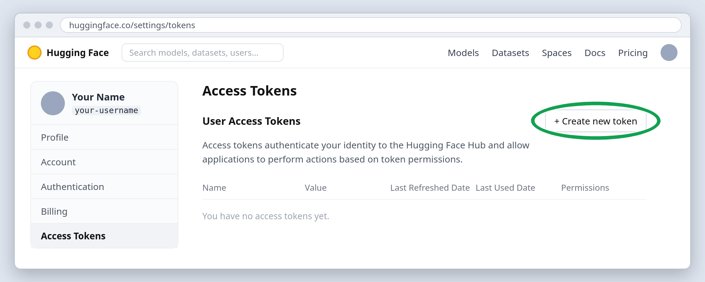
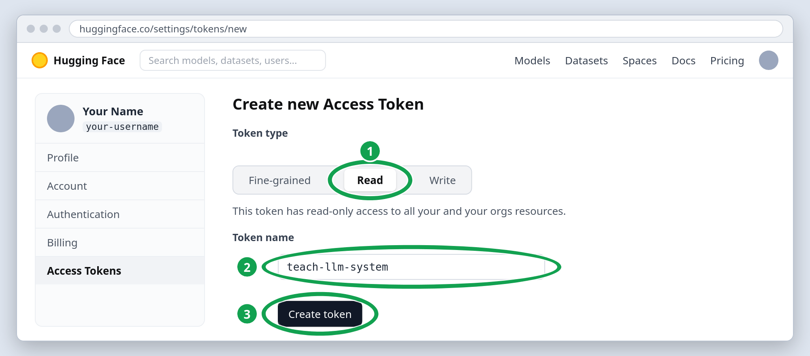
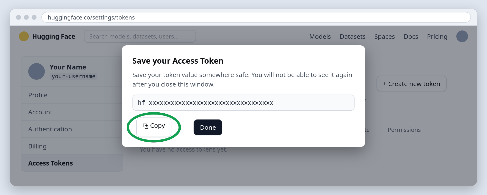
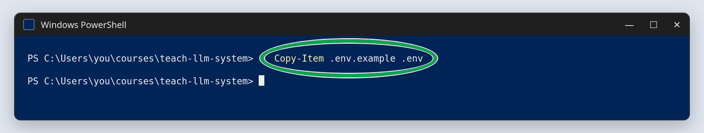
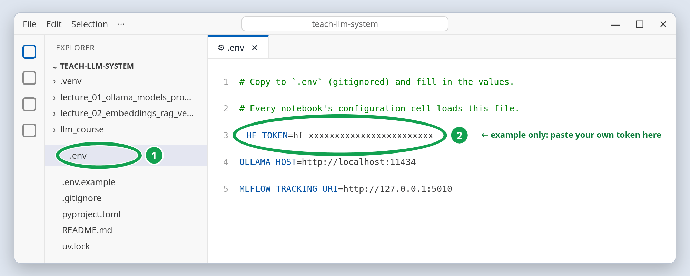

# 01d .env and Hugging Face: your settings file and a read token

## Quick start

1. In a browser, log in at <https://huggingface.co> and open
   <https://huggingface.co/settings/tokens>.

   

1. **Create new token**, role **Read**, name `teach-llm-system`, create it, and copy it.
   The token is shown only once.

   

   

1. Create your settings file: a new file named `.env`, copied from the template
   `.env.example`. In a terminal, from the `teach-llm-system` folder:

   ```powershell
   Copy-Item .env.example .env          # Windows PowerShell
   ```

   ```bash
   cp .env.example .env                 # macOS / Linux
   ```

   

1. Add the token to the new file: open `.env` in VS Code or another plain-text editor,
   paste the token after `HF_TOKEN=` in place of `hf_...`, and save.

   

The sections below explain every step; they are part of the study material. If a step
fails, look up the message in [troubleshooting](../../troubleshooting.md).

## Overview

The **Hugging Face Hub** is where open models live (you used it in the Python course to
deploy a Gradio app to a Space). Lecture 1b searches it through its Python API to choose
a model. Public information works without logging in, but anonymous requests are
rate-limited and some models (for example Meta's Llama family) require you to accept a
license first, which needs an account. A **read token** solves both.

The token is the first entry in **`.env`**, the one file where this course keeps your
personal settings (section 2).

The Hub is documented at
[huggingface.co/docs/hub](https://huggingface.co/docs/hub/index). The Python library
that queries it, `huggingface_hub`, is installed by `uv sync`:
[source on GitHub](https://github.com/huggingface/huggingface_hub),
[documentation](https://huggingface.co/docs/huggingface_hub/index).

## 1. Create the token

1. Log in at <https://huggingface.co> (create an account if you deleted yours).
1. Open <https://huggingface.co/settings/tokens>, click **Create new token**.
1. Choose the **Read** role, name it `teach-llm-system`, create it, and copy it once.

## 2. Your settings file `.env`

A token is a secret, so it does not belong in a notebook. The course keeps it in one
plain-text file, `.env`, in the `teach-llm-system` folder, one `NAME=value` per line.

Why a file:

- **Secrets stay out of the code.** `.env` is listed in `.gitignore`, so git never
  uploads it, and a notebook you share never contains your token.
- **One place for every notebook.** Change a value once, and every notebook uses it the
  next time its configuration cell runs.
- **It stays.** It survives restarts and works the same on every operating system.

### Create it

`.env` is not part of the download: you create it yourself, as a copy of the template
`.env.example` that the course ships. In a terminal, from the `teach-llm-system` folder:

```bash
cp .env.example .env                 # macOS / Linux
Copy-Item .env.example .env          # Windows PowerShell
```

Open `.env` in VS Code or any plain-text editor (not Word) and paste the token after
`HF_TOKEN=`:

```text
HF_TOKEN=hf_xxxxxxxxxxxxxxxxxxxxxxxx
```

`hf_xxx...` stands for your own token; the picture in the quick start shows the file in
VS Code.

Leave the other lines as they are; a later guide tells you when one of them needs a
change. A name that starts with a dot hides the file in the macOS Finder (`Cmd+Shift+.`
shows it) and in `ls` (`ls -a` shows it); VS Code's file panel always shows it.

### How the notebooks read it

The configuration cell at the top of every notebook runs `load_dotenv(REPO / ".env")`.
It copies each line of `.env` into an **environment variable**: a named value the
operating system keeps for a running program, outside its code. The cell then reads each
setting back, for example
`OLLAMA_HOST = os.environ.get("OLLAMA_HOST", "http://localhost:11434")`: the value from
`.env`, or the default after the comma when `.env` does not set it. The
`huggingface_hub` library finds `HF_TOKEN` by itself; your code never names the token.

- **Without a `.env` file** the notebooks still run; only the cells that need the token
  complain.
- **After editing `.env`** while a notebook is open, restart the kernel (**Restart** in
  the notebook toolbar) and run the cells again.

`load_dotenv` comes from `python-dotenv`, installed by `uv sync`:
[source on GitHub](https://github.com/theskumar/python-dotenv).

## 3. Other ways to set a value

`.env` is the course's pattern for every setting. You will meet two other ways:

- **In one notebook.** The configuration cell ends with commented-out lines such as
  `# OLLAMA_HOST = "http://192.168.1.20:11434"`. Delete the `#`, edit the address and
  run the cell: the value applies to that notebook only. Use it to try another address,
  **never for a token**: a notebook is a file you save and share, and the token would
  travel with it.

- **In the terminal.** Other tutorials set a variable before they start a program:

  ```bash
  export OLLAMA_HOST=http://192.168.1.20:11434      # macOS / Linux
  uv run python my_script.py
  ```

  ```powershell
  $env:OLLAMA_HOST = "http://192.168.1.20:11434"    # Windows PowerShell
  uv run python my_script.py
  ```

  The value reaches only programs started from that terminal and is gone when the
  terminal closes. The course does not use it.

A variable that is already set wins over `.env`. If a change to `.env` seems ignored
after a kernel restart, check the terminal: `echo $OLLAMA_HOST` (macOS/Linux) or
`echo $env:OLLAMA_HOST` (PowerShell) should print an empty line.

## 4. If a token ever leaks

Open the tokens page, click **Invalidate and refresh** (or delete it) and create a new
one. Tokens are credentials, like passwords: never paste one into a notebook cell, a
chat, or a screenshot.
