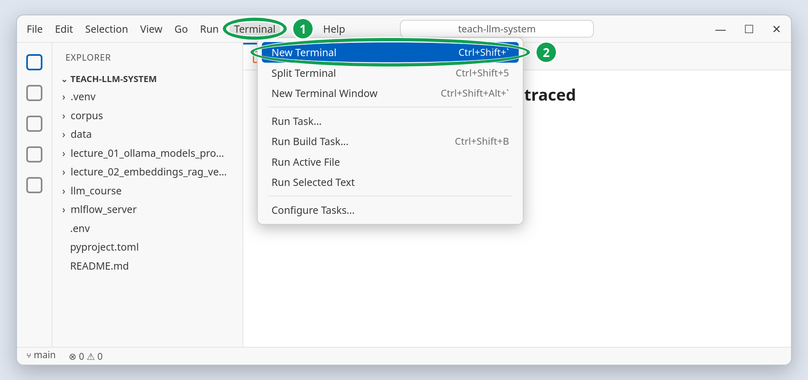
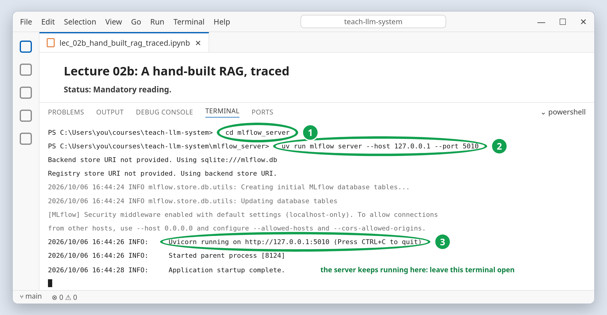
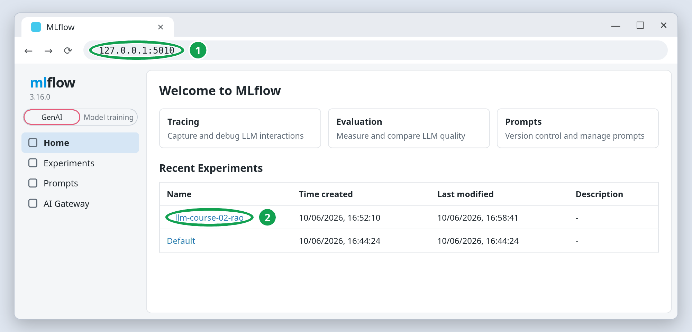
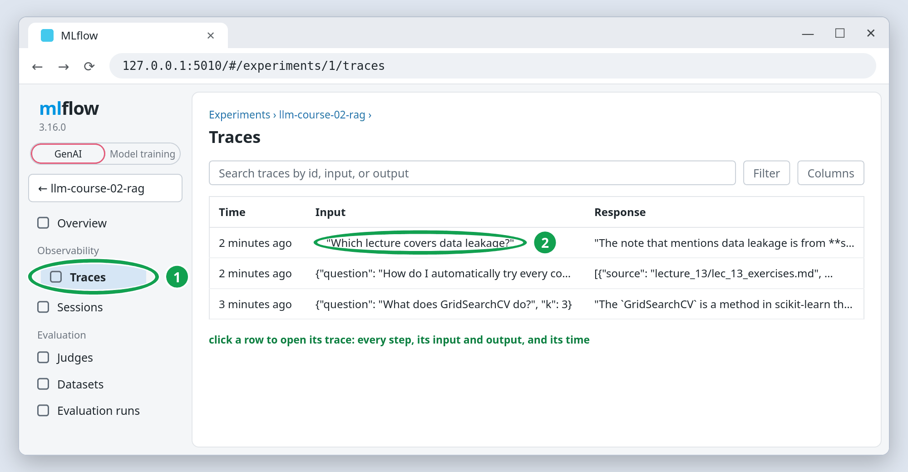

# 02a MLflow server: start the tracking server

## Quick start

**Windows:** open the `teach-llm-system` folder in VS Code and choose **Terminal → New
Terminal**. The terminal opens in that folder.



**macOS / Linux:** the same in VS Code, or any terminal in the `teach-llm-system`
folder.

Then, on every system:

```bash
cd mlflow_server
uv run mlflow server --host 127.0.0.1 --port 5010
```



Leave this terminal open. In a browser, open <http://127.0.0.1:5010>.



The sections below explain every step; they are part of the study material. If a step
fails, look up the message in [troubleshooting](../../troubleshooting.md).

## Overview

From lecture 2 (`lec_02b`) on, the notebooks record every model call as a **trace** in
MLflow, the tool you met in lecture 13 of the Python course. Before opening such a
notebook, start the server with the quick start above: in a **separate terminal**, from
the `mlflow_server/` folder, so its database and artifacts always land in one place.
MLflow: [source on GitHub](https://github.com/mlflow/mlflow),
[documentation](https://mlflow.org/docs/latest/).

At <http://127.0.0.1:5010>, the **Traces** tab of an experiment is where the course's
model calls appear. The experiment `llm-course-02-rag` exists once `lec_02b` has run;
open it from **Recent Experiments** on the home page (2 in the picture above).



## It runs only while its terminal is open

Unlike Ollama (lecture 1, guide `01c_ollama`), the MLflow server is **not** a background
application. It is a program running inside that terminal:

- **Closing the terminal**, or pressing `Ctrl+C` in it, stops the server.
- **After a restart**, it is not running: start it again with the same two commands at
  the beginning of every session.
- **Your runs and traces are not lost** when it stops; they are saved in files (next
  section) and reappear on the next start.

A working session therefore keeps one terminal open, started from the `teach-llm-system`
folder and running the MLflow server, next to the notebooks in VS Code (lecture 1, guide
`01a_git_uv`). VS Code's **Terminal → New Terminal** is a convenient place for it.
Ollama needs no terminal; it runs in the background.

The port is `5010`, not the `5000` you used in the Python course, because `5000` is
often taken (macOS AirPlay, other MLflow servers). If the notebook's check says
`No MLflow server at http://127.0.0.1:5010`, the server is not running.

## Where the data goes

`mlflow_server/mlflow.db` (a SQLite file) and `mlflow_server/mlartifacts/` are created
on first start. They are gitignored: they are your local history, not course material.
To start over, stop the server and delete those two.

## If you must use another port

Start the server with `--port 5011` (or another free port) and put the new address in
your `.env` file (lecture 1, guide `01d_env_hugging_face`):

```text
MLFLOW_TRACKING_URI=http://127.0.0.1:5011
```

Restart the kernel of any open notebook. The configuration cell reads
`MLFLOW_TRACKING_URI` and falls back to port `5010` when `.env` does not set it. For one
notebook only, uncomment the `MLFLOW_URI` line of its configuration cell instead.

## What the terminal shows

The command is the same on Windows, macOS and Linux. On the first start MLflow creates
its database, so the terminal prints a few `Creating initial MLflow database tables`
lines and a note about the security settings. The line to wait for is
`Uvicorn running on http://127.0.0.1:5010` (3 in the terminal picture): the server is
ready. [Uvicorn](https://uvicorn.dev/) is the web server MLflow runs on. Nothing returns
you to the prompt, because the server keeps running in that terminal until you press
`Ctrl+C`.
